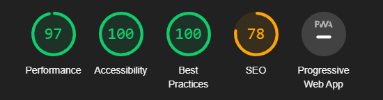
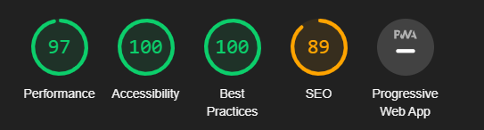
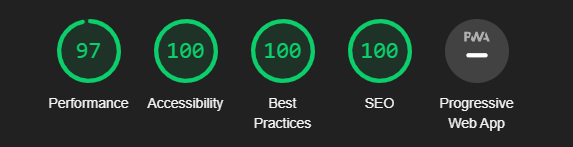
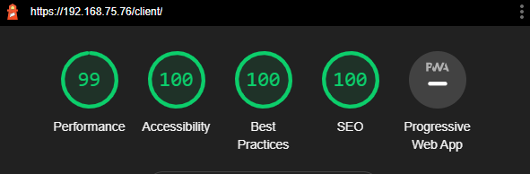

# MIF03-TP

Un dépôt de qualité

## Membres du binôme

- 11702137 Jérémy Thomas
- 11704709 Julien Giraud

## TP 7 : Optimisation d'une Single-Page Application

### Script utilisé pour la réalisation des mesures 

```javascript
console.log("Temps de chargement de la page HTML initiale :", window.performance.timing.responseEnd - window.performance.timeOrigin, " ms") ; 
console.log("Temps d'affichage de l'app shell : ", window.performance.timing.domInteractive - window.performance.timing.domLoading, " ms");
console.log("Temps d'affichage du chemin critique de rendu (CRP) : ", window.performance.timing.domComplete - window.performance.timing.domLoading, " ms");
```

## 1. Analyse de l'état initial de l'application (déploiement sur Tomcat)

Mesure | Temps de chargement de la page HTML initiale (en ms) | Temps d'affichage de l'app shell (en ms) | Temps d'affichage du chemin critique de rendu (CRP) (en ms)
:---:|:---: | :---: | :---:
1 | 45 | 328 | 342
2 | 47 | 375 | 379
3 | 51 | 412 | 421
4 | 48 | 384 | 385
5 | 54 | 423 | 453
6 | 48 | 379 | 378
7 | 44 | 336 | 340
8 | 45 | 437 | 426
9 | 51 | 419 | 407
10 | 48 | 454 | 462
Moyenne | 48 | 394.6 | 399.1

## 2. Déploiement des fichiers statiques sur nginx (déploiement sur nginx)

Mesure | Temps de chargement de la page HTML initiale (en ms) | Temps d'affichage de l'app shell (en ms) | Temps d'affichage du chemin critique de rendu (CRP) (en ms)
:---:|:---: | :---: | :---:
1 | 32 | 159 | 200
2 | 33 | 182 | 222
3 | 36 | 200 | 246
4 | 34 | 186 | 225
5 | 38 | 205 | 265
6 | 34 | 184 | 221
7 | 31 | 163 | 199
8 | 32 | 212 | 249
9 | 36 | 203 | 238
10 | 34 | 220 | 270
Moyenne | 34 | 191.4 | 233.5
Pourcentage d'amélioration | 29.2% | 51.5% | 41.5%

## 3. Optimisation de votre application
### Premier rapport d'audit, avant toute modification.


### Optimisation pour les moteurs de recherche (SEO)
- Rapport après ajout d'une balise ```<meta name="viewport">``` pour contrôler la mise en page sur les navigateurs mobiles.


- Rapport après ajout d'une balise ```<meta name="description">``` pour contrôler la mise en page sur les navigateurs mobiles.


### Optimisation de la performance
- ```Utilisation de CDN``` : Pas de modification, nous utilisons déjà des CDN pour Bootstrap, Mustache et jQuery.

- ```Utilisation d'attributs async et/ou defer pour décaler le chargement de scripts non nécessaires au CRP``` 
	- Modification : ajout de l'attribut ```async``` pour les scritps que nous avons programmé (render.js et script.js). Les CDN (sauf Bootstrap) n'y ont pas droit car ils sont utilisés par notre scripts et async ne garanti pas l'ordre d'exécution. 
		- Amélioration : nous n'avons pas observé d'amélioration notable, le chargement de la page html, d'affichage de l'appshell et du CRP restent dans le même ordre de grandeur.

- ```Minification réduction du nombre de ressources critiques```
	- Les balises ```link``` sont déjà placées en tête du document et le seul code CSS que nous avons écrit est à également en tête du document html. 
	- Modification : Les scripts js sont désormais placés en fin de page.
			- Amélioration : nous n'avons pas observé d'amélioration notable, le chargement de la page html, d'affichage de l'appshell et du CRP restent dans le même ordre de grandeur.

- ```Refactoring de l'application pour charger plus rapidement : app shell, CRP``` : Pas de modifications.

Lighthouse conseille ensuite de retirer le javascript et le css inutilisé, mais il s'agit principalement de code qui provient des CDN sur lesquels nous n'avons pas la main.

### Rapport d'audit final 

