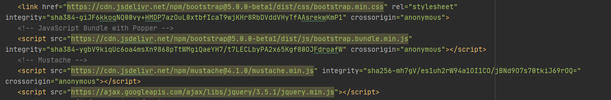

# MIF03-TP

Un dépôt de qualité

## Membres du binôme

- 11702137 Jérémy Thomas
- 11704709 Julien Giraud

## TP 7 : Optimisation d'une Single-Page Application

### Script utilisé pour la réalisation des mesures 

```javascript
console.log("Temps de chargement de la page HTML initiale :", window.performance.timing.responseEnd - window.performance.timeOrigin, " ms") ; 
console.log("Temps d'affichage de l'app shell : ", window.performance.timing.domInteractive - window.performance.timing.domLoading, " ms");
console.log("Temps d'affichage du chemin critique de rendu (CRP) : ", window.performance.timing.domComplete - window.performance.timing.domLoading, " ms");
```

## 1. Analyse de l'état initial de l'application (déploiement sur Tomcat)

Mesure | Temps de chargement de la page HTML initiale (en ms) | Temps d'affichage de l'app shell (en ms) | Temps d'affichage du chemin critique de rendu (CRP) (en ms)
:---:|:---: | :---: | :---:
1 | 61 | 102 | 122
2 | 50 | 83 | 103
3 | 51 | 127 | 147
4 | 62 | 245 | 265
5 | 48 | 149 | 169
6 | 56 | 128 | 149
7 | 60 | 190 | 210
8 | 45 | 125 | 145
9 | 55 | 153 | 174
10 | 53 | 201 | 221
Moyenne | 54.1 | 150.3 | 170.5

## 2. Déploiement des fichiers statiques sur nginx (déploiement sur nginx)

Mesure | Temps de chargement de la page HTML initiale (en ms) | Temps d'affichage de l'app shell (en ms) | Temps d'affichage du chemin critique de rendu (CRP) (en ms)
:---:|:---: | :---: | :---:
1 | 39 | 67 | 86
2 | 43 | 71 | 89
3 | 31 | 71 | 90
4 | 32 | 80 | 102
5 | 35 | 75 | 96
6 | 33 | 76 | 97
7 | 33 | 69 | 89
8 | 37 | 75 | 97
9 | 36 | 75 | 93
10 | 64 | 70 | 90
Moyenne | 38.3 | 72.9 | 92.9
Pourcentage d'amélioration | 29.2% | 51.5% | 45.5%

## 3. Optimisation de votre application
### Premier rapport d'audit, avant toute modification.


### Optimisation pour les moteurs de recherche (SEO)
- Rapport après ajout d'une balise ```<meta name="viewport">``` pour contrôler la mise en page sur les navigateurs mobiles.


- Rapport après ajout d'une balise ```<meta name="description">``` pour contrôler la mise en page sur les navigateurs mobiles.


### Optimisation de la performance
- ```Utilisation de CDN```
	- Notre utilise déjà des CDN pour Bootstrap, Mustache et jQuery.
		

- ```Utilisation d'attributs async et/ou defer pour décaler le chargement de scripts non nécessaires au CRP```
	- Pas de modifications : Notre script utilise déjà des appels ajax asynchrones (par défaut, la valeur de l'option async de jQuery.ajax() est true et nous ne l'avons pas modifié).

- ```Minification réduction du nombre de ressources critiques```
	- Les balises ```link``` sont déjà placées en tête du document et le seul code CSS que nous avons écrit est à également en tête du document html. 
	- Modifications : Les scripts js sont désormais placés en fin de page et ajout de l'attribut ```javascript async``` pour les scrips que nous avons programmé. Les CDN (sauf Bootstrap) n'y ont pas droit car ils sont utilisés par notre scripts et async ne garanti pas l'ordre d'exécution. 